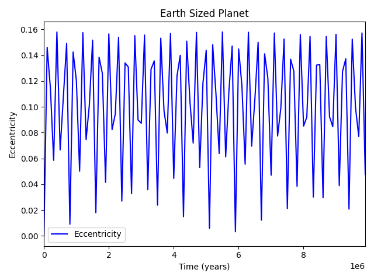

# Water Transport to Habitable Exoplanet research

4 simulations were ran, each with different starting parameters for EARTHMOO and JUPITER. Simulations are ran for *10 million* years  

 
Simulations where Jupiter Eccentricity is changed are run_1, and run_2

 
Simulations where Jupiter inclination is changed are run_3, and run_4

 
The Control run is run_5

## run1
Initial conditions for EARTHMOO are:

| a             | e             | i     |   peri   |  node   |   M  | mass |
| ------------- |:-------------:| -----:|---------:|--------:|-----:|-----:|
| 1.0           | 0.0           | 0.0   |  0.0     |  0.0.   |  101.564|0.000009|

Initial conditions for JUPITER are:

| a             | e             | i     |   peri   |  node   |   M  | mass |
| ------------- |:-------------:| -----:|---------:|--------:|-----:|-----:|
| 5.20336          | 0.1           | 0.0   |  14.331     |  0.0.   |  20.02|0.000955|

Graphs of Eccentricity vs. Time  

 

 

## run2
Initial conditions for EARTHMOO are:

| a             | e             | i     |   peri   |  node   |   M  | mass |
| ------------- |:-------------:| -----:|---------:|--------:|-----:|-----:|
| 1.0           | 0.0           | 0.0   |  0.0     |  0.0.   |  101.564|0.000009|

Initial conditions for JUPITER are:

| a             | e             | i     |   peri   |  node   |   M  | mass |
| ------------- |:-------------:| -----:|---------:|--------:|-----:|-----:|
| 5.20336          | 0.3           | 0.0   |  14.331     |  0.0.   |  20.02|0.000955|

Graphs of Eccentricity vs. Time  

 

 

## run3
Initial conditions for EARTHMOO are:

| a             | e             | i     |   peri   |  node   |   M  | mass |
| ------------- |:-------------:| -----:|---------:|--------:|-----:|-----:|
| 1.0           | 0.0           | 0.0   |  0.0     |  0.0.   |  101.564|0.000009|

Initial conditions for JUPITER are:

| a             | e             | i     |   peri   |  node   |   M  | mass |
| ------------- |:-------------:| -----:|---------:|--------:|-----:|-----:|
| 5.20336          | 0.0           | 30   |  259.536     |  100.464   |  34.351|0.000955|

Graphs of Eccentricity vs. Time  

 

 

## run4
Initial conditions for EARTHMOO are:

| a             | e             | i     |   peri   |  node   |   M  | mass |
| ------------- |:-------------:| -----:|---------:|--------:|-----:|-----:|
| 1.0           | 0.0           | 0.0   |  0.0     |  0.0.   |  101.564|0.000009|

Initial conditions for JUPITER are:

| a             | e             | i     |   peri   |  node   |   M  | mass |
| ------------- |:-------------:| -----:|---------:|--------:|-----:|-----:|
| 5.20336          | 0.0           | 60   |  259.536     |  100.464   |  34.351|0.000955|

Graphs of Eccentricity vs. Time  

 

 

## run5
Initial conditions for EARTHMOO are:

| a             | e             | i     |   peri   |  node   |   M  | mass |
| ------------- |:-------------:| -----:|---------:|--------:|-----:|-----:|
| 1.0           | 0.0           | 0.0   |  0.0     |  0.0.   |  101.564|0.000009|

Initial conditions for JUPITER are:

| a             | e             | i     |   peri   |  node   |   M  | mass |
| ------------- |:-------------:| -----:|---------:|--------:|-----:|-----:|
| 5.20336          | 0.0           | 0.0   |  259.536     |  100.464   |  34.351|0.000955|

Graphs of Eccentricity vs. Time  

 

 

