# Water Transport to Habitable Exoplanet research

4 simulations were ran, each with different starting parameters for EARTHMOO and JUPITER. Simulations are ran for *10 million* years  

 
Simulations where Jupiter Eccentricity is changed are run_1(0.1), run_6(0.2), run_2(0.3), run_9(0.4), and run_7(0.5)

 
Simulations where Jupiter inclination is changed are run_10(15), run_3(30), run_8(45), and run_4(60)
 
Simulations where Jupiter Distance is changed are run_11(3.20336 au), run_12(4.20336 au), run_13(6.20336), run_14(7.20336), and run_15(8.20336)
 
The Control run is run_5: a=5.20336, e = 0.0, i = 0.0

 
Currently running simulations are: 
run_9 
run_10 

## run1
Initial conditions for EARTHMOO are:

| a             | e             | i     |   peri   |  node   |   M  | mass |
| ------------- |:-------------:| -----:|---------:|--------:|-----:|-----:|
| 1.0           | 0.0           | 0.0   |  0.0     |  0.0.   |  101.564|0.000009|

Initial conditions for JUPITER are:

| a             | e             | i     |   peri   |  node   |   M  | mass |
| ------------- |:-------------:| -----:|---------:|--------:|-----:|-----:|
| 5.20336          | 0.1           | 0.0   |  14.331     |  0.0.   |  20.02|0.000955|

Graphs of Eccentricity vs. Time  
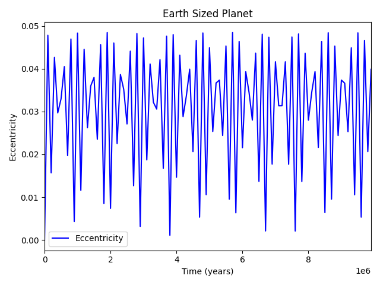
 
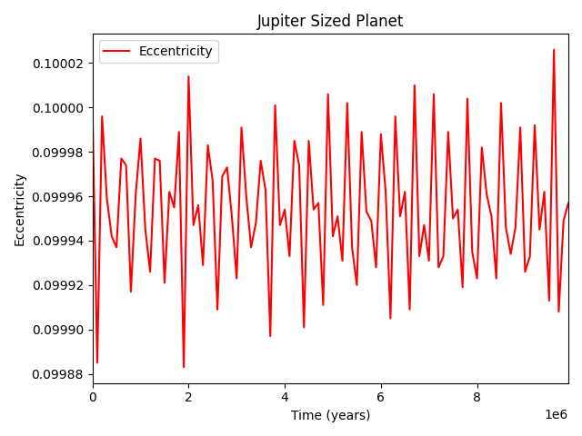
 
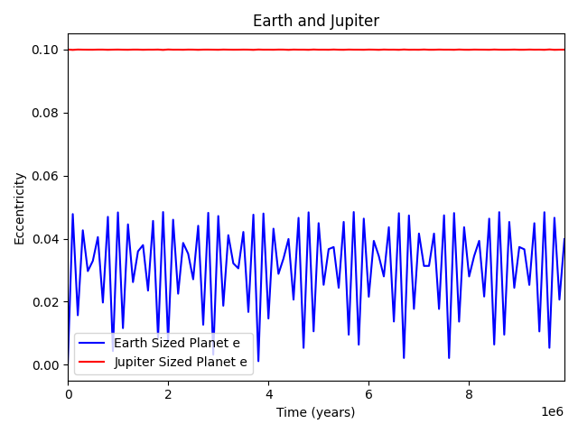

## run2
Initial conditions for EARTHMOO are:

| a             | e             | i     |   peri   |  node   |   M  | mass |
| ------------- |:-------------:| -----:|---------:|--------:|-----:|-----:|
| 1.0           | 0.0           | 0.0   |  0.0     |  0.0.   |  101.564|0.000009|

Initial conditions for JUPITER are:

| a             | e             | i     |   peri   |  node   |   M  | mass |
| ------------- |:-------------:| -----:|---------:|--------:|-----:|-----:|
| 5.20336          | 0.3           | 0.0   |  14.331     |  0.0.   |  20.02|0.000955|

Graphs of Eccentricity vs. Time  
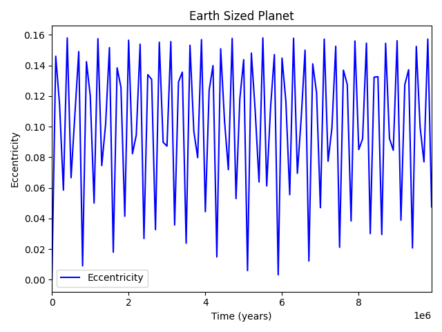
 
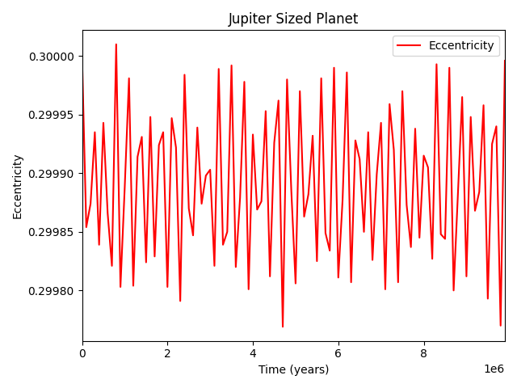
 
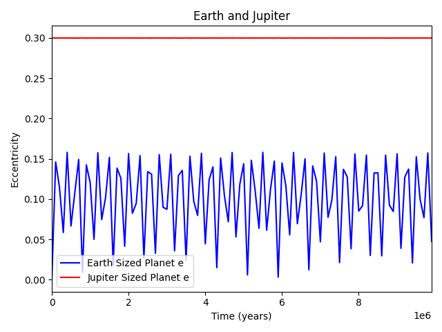

## run3
Initial conditions for EARTHMOO are:

| a             | e             | i     |   peri   |  node   |   M  | mass |
| ------------- |:-------------:| -----:|---------:|--------:|-----:|-----:|
| 1.0           | 0.0           | 0.0   |  0.0     |  0.0.   |  101.564|0.000009|

Initial conditions for JUPITER are:

| a             | e             | i     |   peri   |  node   |   M  | mass |
| ------------- |:-------------:| -----:|---------:|--------:|-----:|-----:|
| 5.20336          | 0.0           | 30   |  259.536     |  100.464   |  34.351|0.000955|

Graphs of Eccentricity vs. Time  
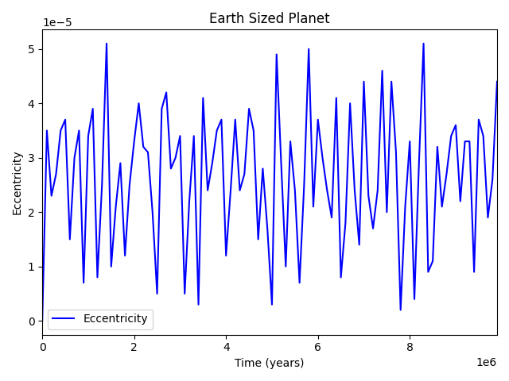
 
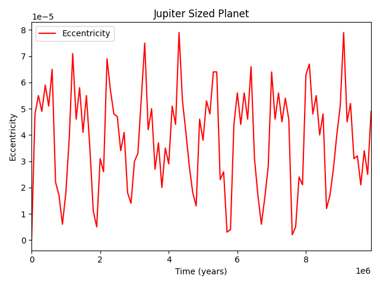
 
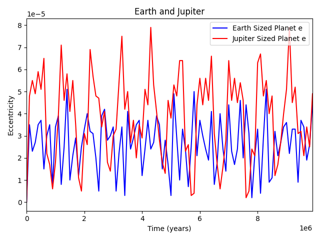

## run4
Initial conditions for EARTHMOO are:

| a             | e             | i     |   peri   |  node   |   M  | mass |
| ------------- |:-------------:| -----:|---------:|--------:|-----:|-----:|
| 1.0           | 0.0           | 0.0   |  0.0     |  0.0.   |  101.564|0.000009|

Initial conditions for JUPITER are:

| a             | e             | i     |   peri   |  node   |   M  | mass |
| ------------- |:-------------:| -----:|---------:|--------:|-----:|-----:|
| 5.20336          | 0.0           | 60   |  259.536     |  100.464   |  34.351|0.000955|

Graphs of Eccentricity vs. Time  
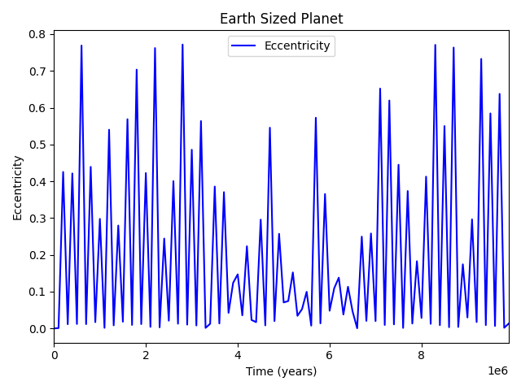
 
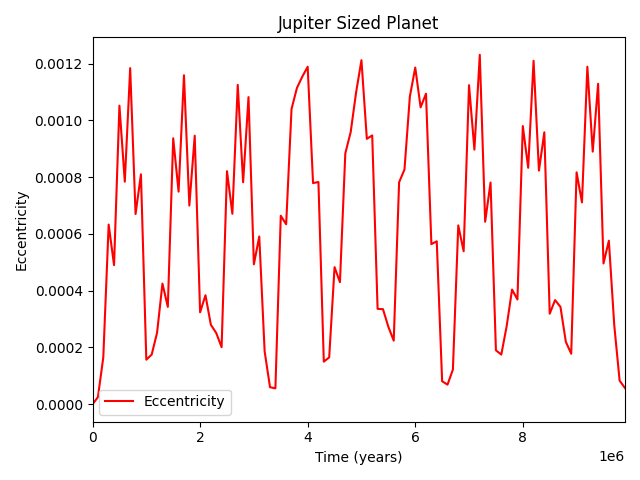
 
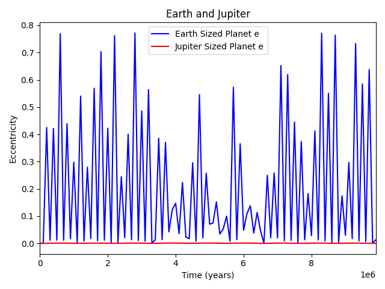

## run5
Initial conditions for EARTHMOO are:

| a             | e             | i     |   peri   |  node   |   M  | mass |
| ------------- |:-------------:| -----:|---------:|--------:|-----:|-----:|
| 1.0           | 0.0           | 0.0   |  0.0     |  0.0.   |  101.564|0.000009|

Initial conditions for JUPITER are:

| a             | e             | i     |   peri   |  node   |   M  | mass |
| ------------- |:-------------:| -----:|---------:|--------:|-----:|-----:|
| 5.20336          | 0.0           | 0.0   |  259.536     |  100.464   |  34.351|0.000955|

Graphs of Eccentricity vs. Time  
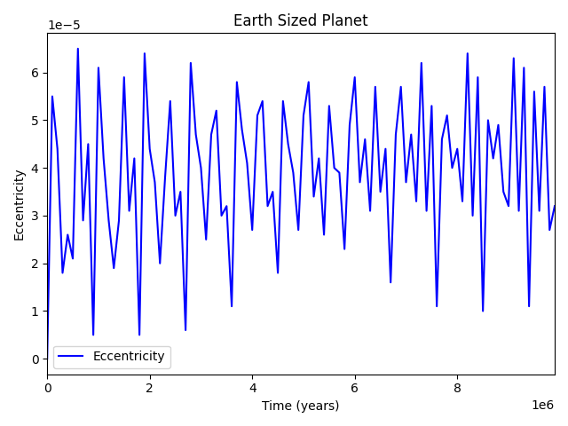
 
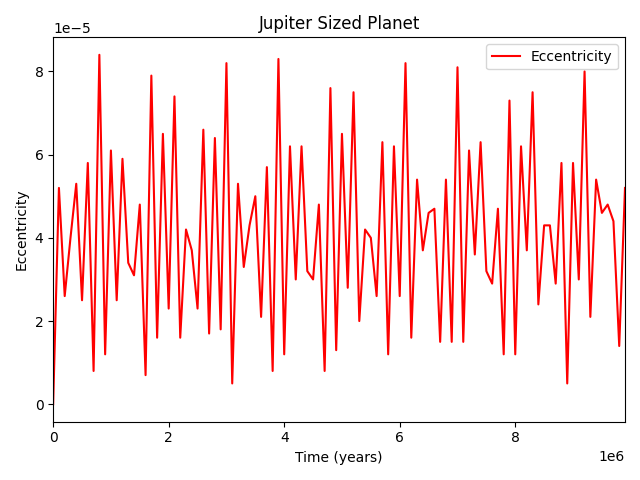
 
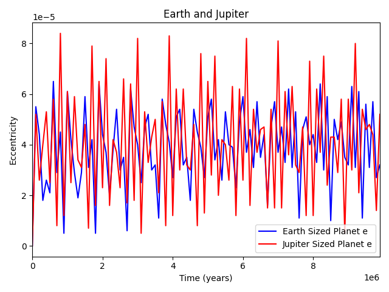

## run6
Initial conditions for EARTHMOO are:

| a             | e             | i     |   peri   |  node   |   M  | mass |
| ------------- |:-------------:| -----:|---------:|--------:|-----:|-----:|
| 1.0           | 0.0           | 0.0   |  0.0     |  0.0.   |  101.564|0.000009|

Initial conditions for JUPITER are:

| a             | e             | i     |   peri   |  node   |   M  | mass |
| ------------- |:-------------:| -----:|---------:|--------:|-----:|-----:|
| 5.20336          | 0.2           | 0.0   |  259.536     |  100.464   |  34.351|0.000955|

Graphs of Eccentricity vs. Time  
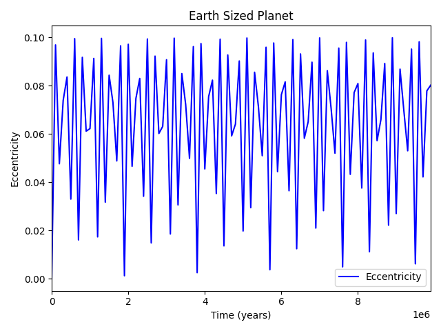
 
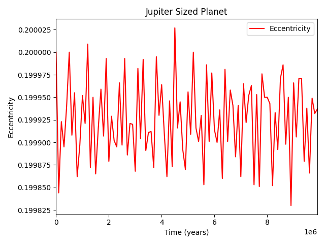
 
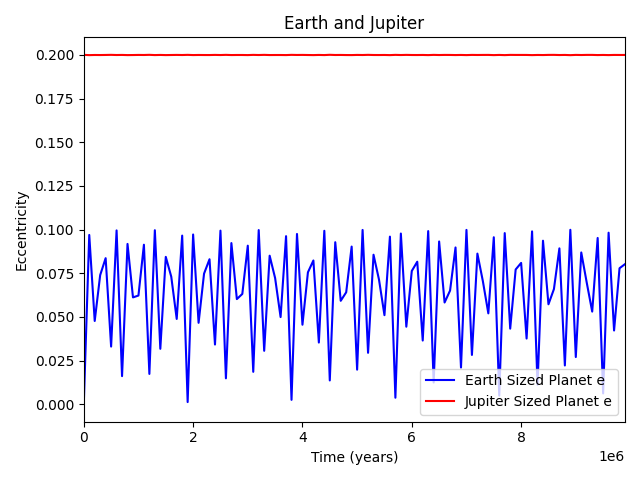

## run7
Initial conditions for EARTHMOO are:

| a             | e             | i     |   peri   |  node   |   M  | mass |
| ------------- |:-------------:| -----:|---------:|--------:|-----:|-----:|
| 1.0           | 0.0           | 0.0   |  0.0     |  0.0.   |  101.564|9.121298E-06|

Initial conditions for JUPITER are:

| a             | e             | i     |   peri   |  node   |   M  | mass |
| ------------- |:-------------:| -----:|---------:|--------:|-----:|-----:|
| 5.20336       | 0.5           | 0.0   |  14.3310 |  0.0000| 20.0200| 9.547|

Graphs of Eccentricity vs. Time  
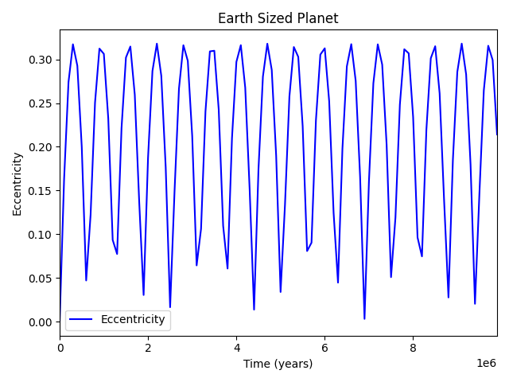
 
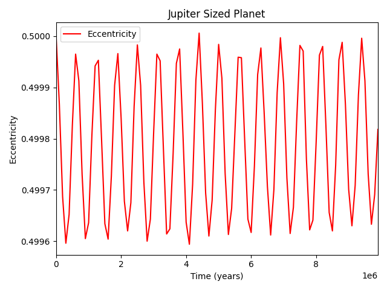
 
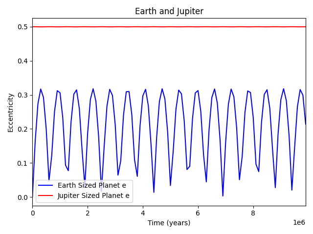

## run_8
Initial conditions for EARTHMOO are:

| a             | e             | i     |   peri   |  node   |   M  | mass |
| ------------- |:-------------:| -----:|---------:|--------:|-----:|-----:|
| 1.0           | 0.0           | 0.0   |  0.0     |  0.0.   |  101.564|9.121298E-06|

Initial conditions for JUPITER are:

| a             | e             | i     |   peri   |  node   |   M  | mass |
| ------------- |:-------------:| -----:|---------:|--------:|-----:|-----:|
| 5.20336       | 0.0           | 45.0   |  14.3310 |  0.0000| 20.0200| 9.547|

Graphs of Eccentricity vs. Time  
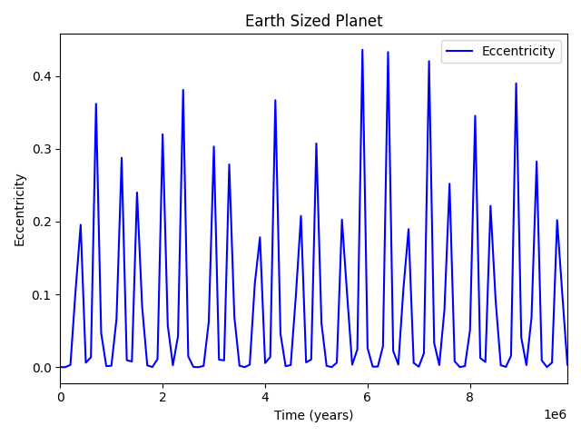
 
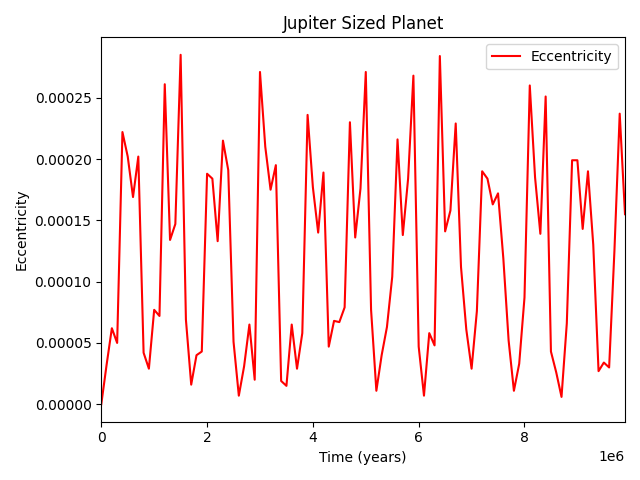
 
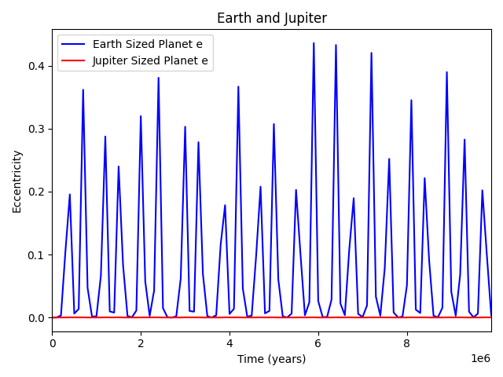
